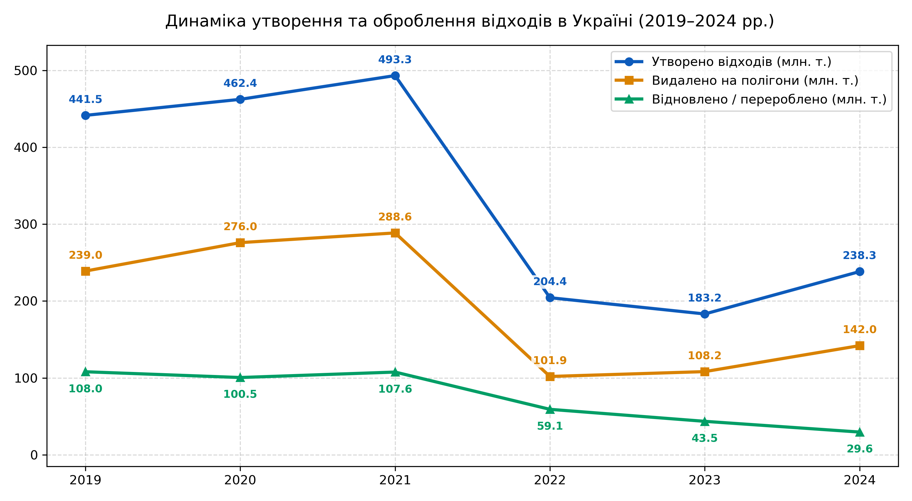
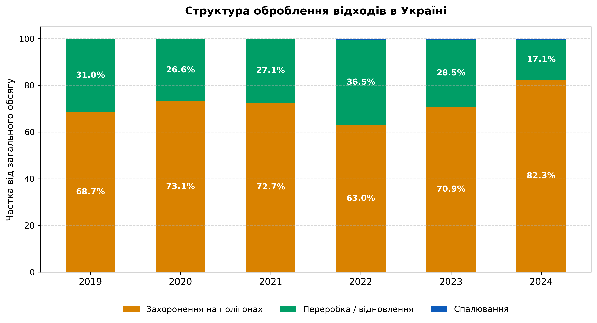
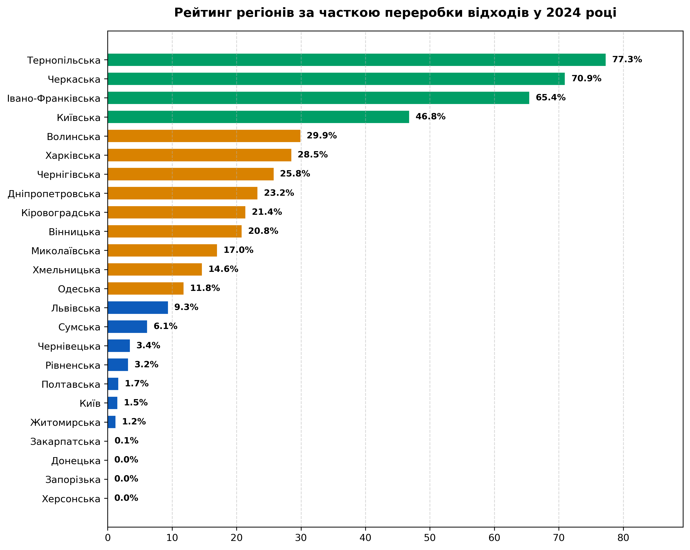

# Аналіз утворення та оброблення відходів в Україні за 2019–2024 рр.

Цей репозиторій містить аналітичний проєкт та дослідження даних щодо динаміки утворення, утилізації, спалювання та видалення відходів в Україні за 6-річний період.

---

## Мета проєкту

Здійснити комплексний якісний та кількісний аналіз обсягів відходів, оцінити ефективність їх оброблення (утилізація, рециклінг, спалювання, захоронення) та виявити ключові тренди й структурні зсуви під впливом економічних чинників та повномасштабного вторгнення.

---

## Джерела та характеристика даних

* **Джерело:** Офіційні звіти Державної Служби Статистики України ([stat.gov.ua](https://stat.gov.ua)).
* **Формат даних:** Дані отримані безпосередньо у форматі `.csv`. 
* **Обсяг та гранулярність:** Датасет містить 23 810 записів щодо утворення та оброблення відходів в Україні за період з 2015 по 2024 рік, з яких для дослідження відфільтровано період 2019–2024 рр. 
* **Структуризація:** Дані деталізовані за адміністративно-територіальним розрізом (області), класами небезпеки (I–IV класи) та джерелами утворення відходів.

> **Примітка щодо повноти даних:** Приблизно 34% записів мають пропущені значення спостережень, що пов'язано з відсутністю звітності з тимчасово окупованих територій та змінами в методології обліку починаючи з 2022 року.

---

## Опис показників

У цьому дослідженні аналізується динаміка чотирьох ключових показників поводження з відходами. Усі дані вимірюються у **тис. тонн**

| Показник | Опис / Тлумачення |
| :--- |  :--- |
| **Обсяг утворених відходів** | Загальна маса відходів, що утворилися внаслідок економічної діяльності підприємств та життєдіяльності домогосподарств за звітний рік. |
| **Обсяг відновлених відходів** | Маса відходів, що були перероблені, утилізовані або залучені до повторного використання (рециклінгу). |
| **Обсяг спалених відходів** |  Маса відходів, знищених шляхом термічного оброблення (як з метою отримання енергії, так і без неї). |
| **Обсяг видалених відходів** | Маса відходів, що була остаточно розміщена на спеціально обладнаних полігонах та сміттєзвалищах (захоронення). |

## Результати аналізу

### 1. Аналіз динаміки утворення та оброблення відходів

* **2019–2021 рр. (Довоєнний період):** Утворення відходів демонструвало стабільне зростання і сягнуло пікового значення **493,3 млн. тонн** у 2021 році. При цьому захоронення на полігонах зростало швидше, ніж відновлення, що підкреслює відсутність системних зрушень у переробці до війни.
* **2022 рік (Початок повномасштабного вторгнення):** Офіційне значення показників скоротилось більш ніж вдвічі. Це зумовлено втратою обліку на тимчасово окупованих територіях, зупинкою великих промислових гігантів (гірничо-збагачувальних та металургійних комбінатів Сходу України), а також дією Закону № 2115-IX «Про захист інтересів суб'єктів подання звітності...», який дозволив підприємствам не подавати статистичні звіти (зокрема форму № 1-відходи) до завершення воєнного стану.
* **2022–2024 рр. (Посткризовий тренд):** Обсяг відновлення (переробки) продовжує падати третій рік поспіль. Це призводить до того, що частка захоронення відходів на полігонах зростає значно швидше за їх повторне використання.

### 2. Структура оброблення відходів

Аналіз абсолютних показників після 2022 року демонструє хибнопозитивну динаміку, тож далі проведено аналіз відносних показників (% від загального обсягу). Це дозволяє оцінити реальну ефективність переробки незалежно від загальних масштабів скорочення економіки.

Тож незважаючи на спад валових показників у тоннах, у відсотковому співвідношенні чітко видно структурне погіршення: частка захоронення на полігонах досягла історичного піку у 2024 році (**82,3%**), тоді як частка переробки впала майже вдвічі порівняно з 2019 роком (з **31,0%** до **17,1%**). 

*Примітка:* Тимчасовий стрибок частки переробки у 2022 році (до 36,5%) пояснюється першочерговою втратою звітності від великих промислових об'єктів захоронення на Сході України, а не реальним зростанням потужностей рециклінгу.

### 3. Регіональний розріз ефективності переробки (2024 р.)

Аналіз показує, що найвищий відсоток переробки відходів спостерігається у Тернопільській (**77,3%**), Черкаській (**70,9%**) та Івано-Франківській (**65,4%**) областях. Проте це пов'язано не з розвиненою комунальною інфраструктурою сортування побутового сміття, а зі структурою місцевої економіки:

* **Агросектор (Черкащина, Тернопільщина):** Основу відходів складають органічні залишки сільського господарства та харчової промисловості. Підприємства одразу пускають їх у повторний цикл — як добрива, корми або біопаливо для власних котелень.
* **Деревообробка (Івано-Франківщина):** Велику частку займають відходи лісозаготівлі, які масово переробляються на пелети, плити ДСП/ДВП або спалюються для генерації тепла.

